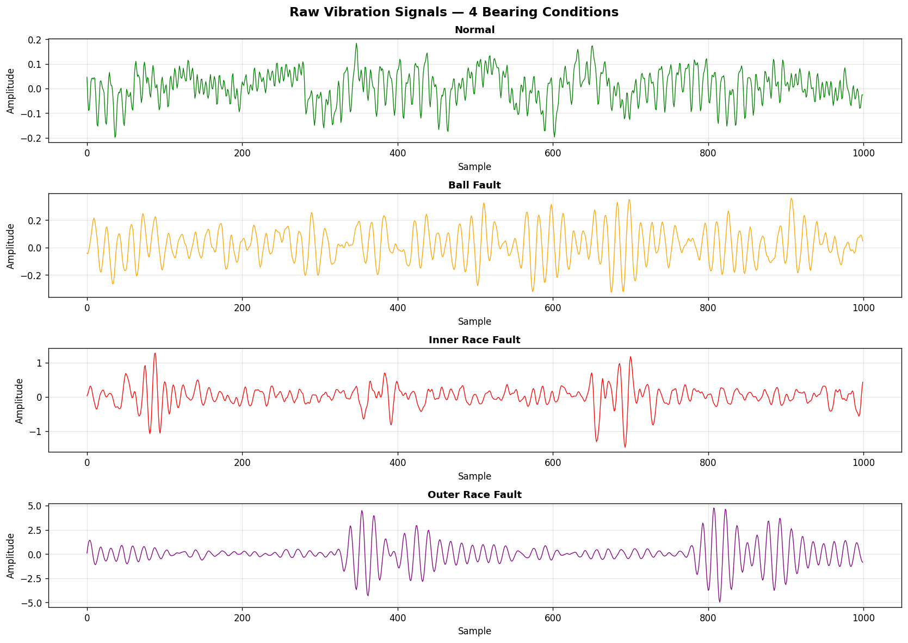
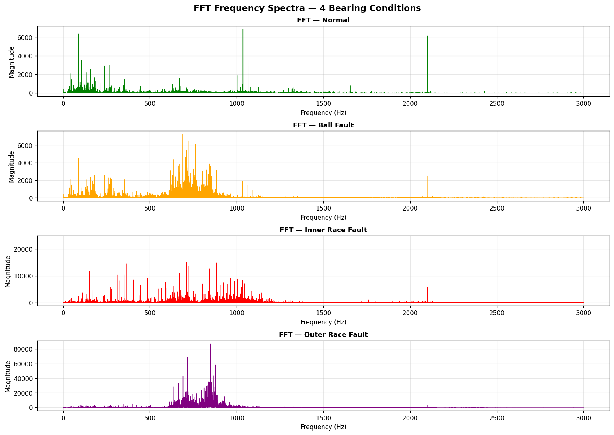
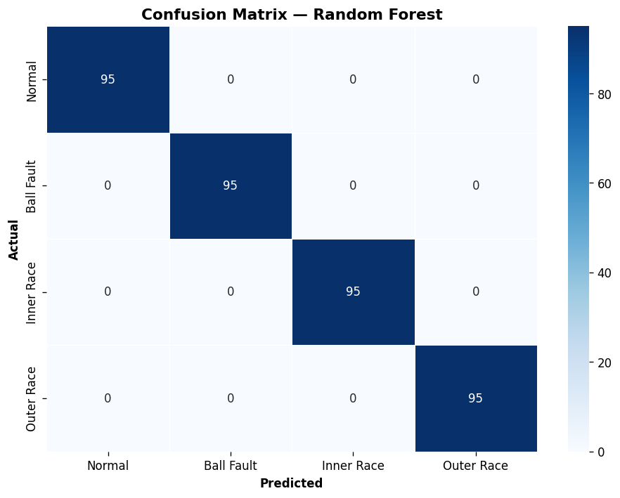
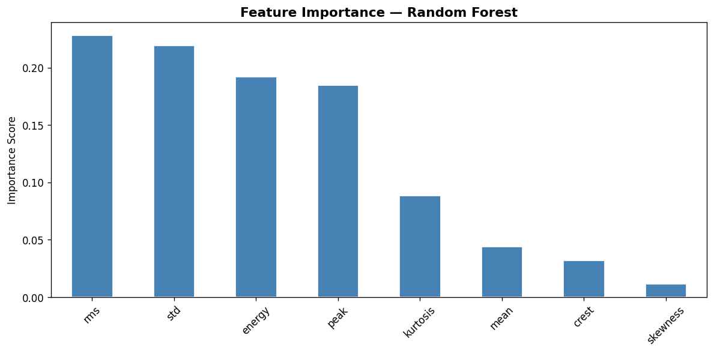

# bearing_fault_detection
Bearing fault detection using vibration signal processing and ML — 100% accuracy on CWRU dataset
# Bearing Fault Detection using Vibration Analysis & ML

## Overview
Automated detection of rotating machinery bearing faults using 
vibration signal processing and machine learning, achieving 
100% classification accuracy on the CWRU benchmark dataset.

## Problem Statement
Bearing failures account for 40-50% of all rotating machinery 
breakdowns in industrial settings. Early fault detection using 
vibration analysis can prevent unexpected failures and reduce 
maintenance costs significantly.

## Dataset
**CWRU (Case Western Reserve University) Bearing Dataset**
- 4 conditions: Normal, Ball Fault, Inner Race Fault, Outer Race Fault
- Sampling rate: 12,000 samples/second
- Total samples after segmentation: 1,896 segments
- Segment size: 1,024 samples per segment

## Methodology
1. **Raw Signal Visualization** — plotted time-domain vibration 
   signals for all 4 bearing conditions, confirming visible 
   differences between healthy and faulty bearings
2. **FFT Frequency Analysis** — applied Fast Fourier Transform 
   to identify unique frequency fingerprints for each fault type
3. **Feature Extraction** — extracted 8 statistical features 
   (RMS, STD, Kurtosis, Crest Factor, Peak, Skewness, Energy, Mean)
   from each signal segment
4. **ML Classification** — trained and compared Logistic Regression 
   vs Random Forest classifier

## Results
| Model | Accuracy | Precision | Recall | F1-Score |
|---|---|---|---|---|
| Logistic Regression | baseline | - | - | - |
| **Random Forest** | **100%** | **1.00** | **1.00** | **1.00** |

Zero misclassifications across all 380 test samples.

## Key Finding
RMS, Standard Deviation, and Energy were the most discriminative 
features for fault classification, consistent with the physical 
understanding that bearing faults increase vibration energy and 
amplitude in rotating machinery.

## Plots

## Tools & Libraries
Python, NumPy, SciPy, Scikit-learn, Matplotlib, Seaborn, Pandas

## Author
**Irene Boruah**
Mechanical Engineering Student, Dibrugarh University Institute 
of Engineering and Technology
- Email: ireneboruah2004@gmail.com
- LinkedIn: linkedin.com/in/ireneboruahresume123
